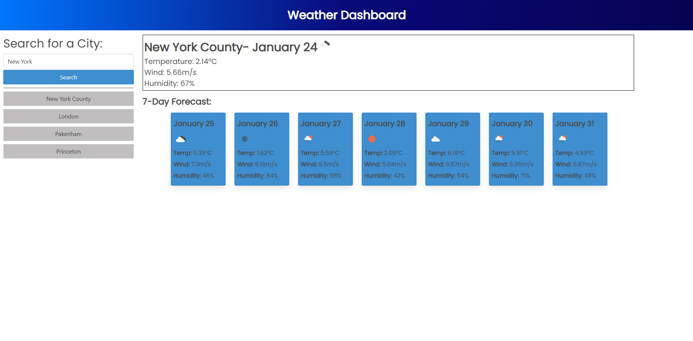

# Weather Dashboard

## Description

This application has been designed to allow the user easy, readily available information about current and future weather, both at their current location as well as any other areas they wish to discern more about.

    - The application uses both browser-based geolocation settings as well as a paired usage of geolocating API and Open Weather API.
    - This application keeps track of the five most recent search entries for the user convenience.

## Installation

This application is currently running at: https://garrettchaney.github.io/weather-dashboard/

## Usage

Upon loading the page the user will be presented with the option to share their location with the browser. If accepted, the weather based upon the user's current location will be displayed, as well as a seven day forecast.
 
    - The user can decline to share their location with zero repercussions.

The user can search for cities using the provided search input. If multiple city options exist, the user will be presented a table from which to select the location they desire specifically, and after which will be provided both the current forecast as well as a the future seven days.

## License
See attached license.

## Mockup Image

